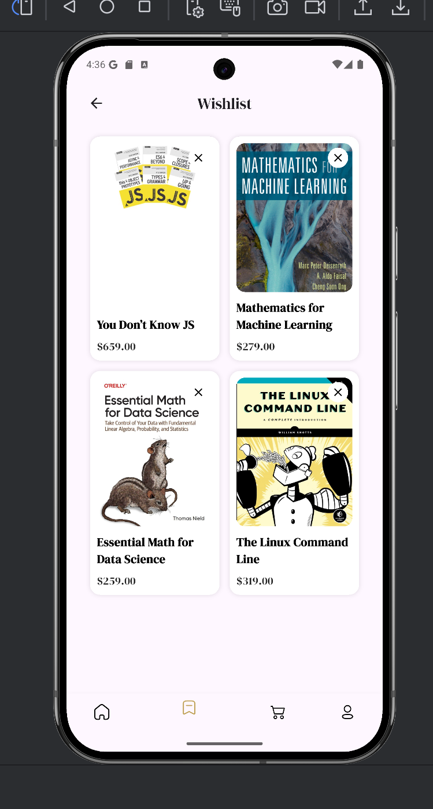
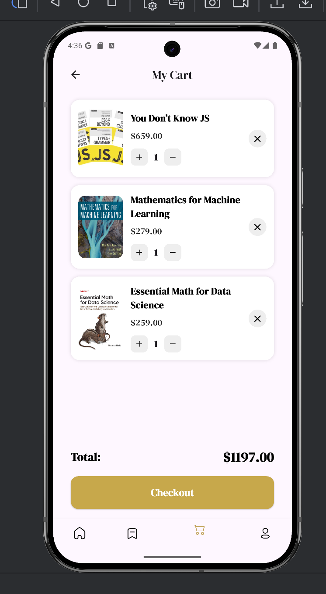
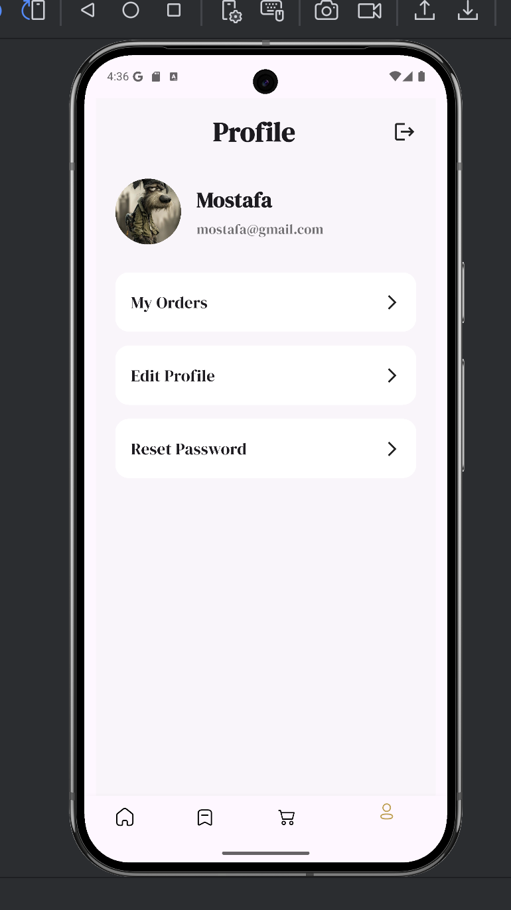
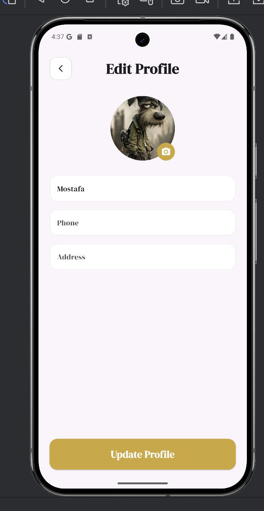
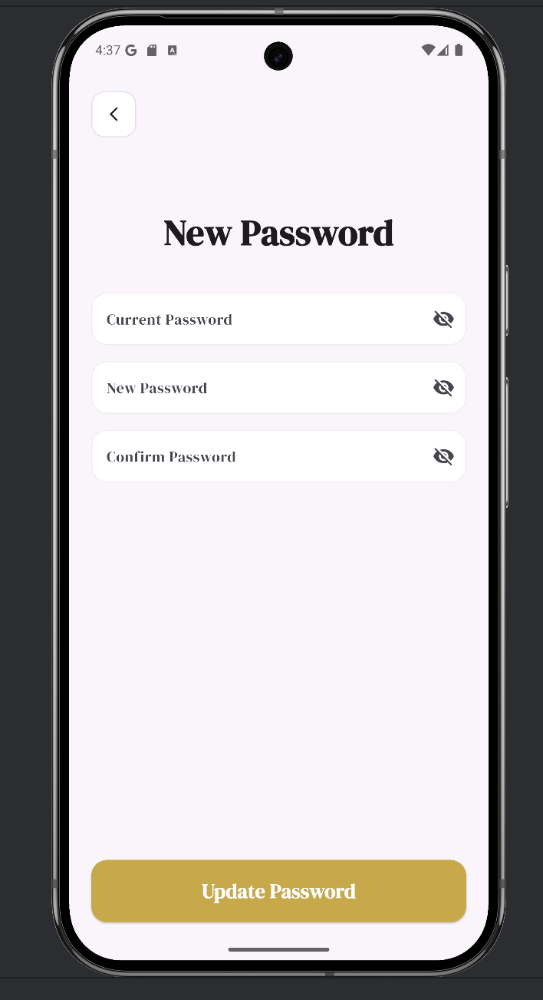

# 📚 Bookia

**Bookia** is a Flutter bookstore application that provides a smooth and modern user experience for browsing books, managing favorites, adding items to cart, updating profile details, and handling authentication flows.

---

## ✨ Features

- 🌍 Multi-language support (English / Arabic)
- 🔐 Authentication system
    - Login
    - Register
    - Forgot Password
    - OTP Verification
    - Create New Password
    - Password Changed
- 🏠 Home screen with featured books
- 📖 Product details screen
- ❤️ Wishlist screen
- 🛒 Cart screen
- 👤 Profile screen
- ✏️ Edit profile screen
- 🔒 Change password screen
- 📦 My orders screen
- 📱 Responsive UI using `flutter_screenutil`

## 📸 Screenshots

<p align="center">
  
  
  
</p>

<p align="center">
  
  
  
</p>

<p align="center">
  
  
  
</p>

<p align="center">
  
  
  
</p>

<p align="center">
  
  
  
</p>

<p align="center">
  
</p>

---

## 🛠️ Tech Stack

- **Flutter**
- **Dart**
- **Cubit / Bloc**
- **Dio**
- **Easy Localization**
- **Shared Preferences**
- **Image Picker**

---

## 📂 Project Structure

```bash
lib
├── core
├── features
│   ├── auth
│   ├── home
│   ├── wishlist
│   ├── cart
│   ├── profile
│   └── order
└── main.dart