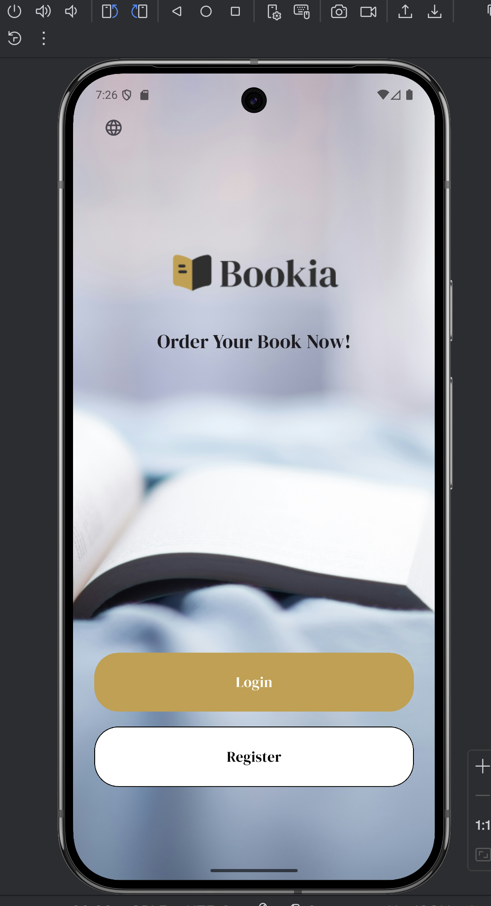
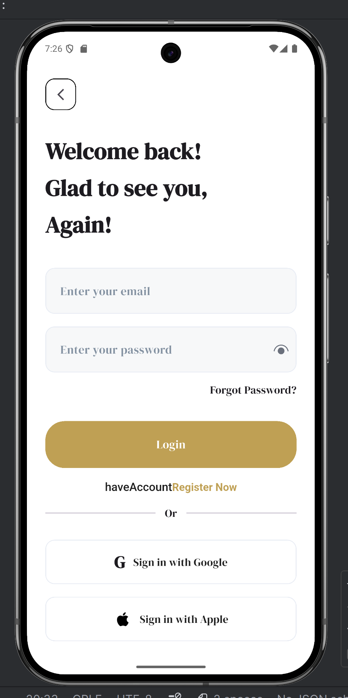
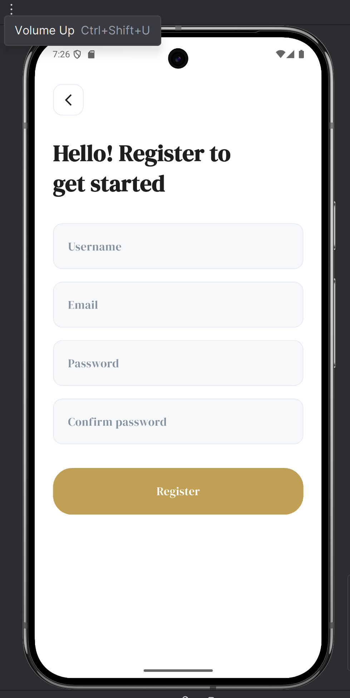
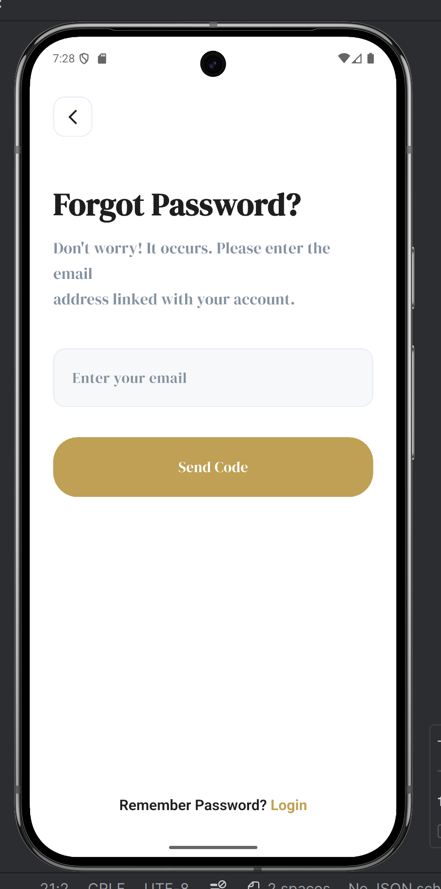
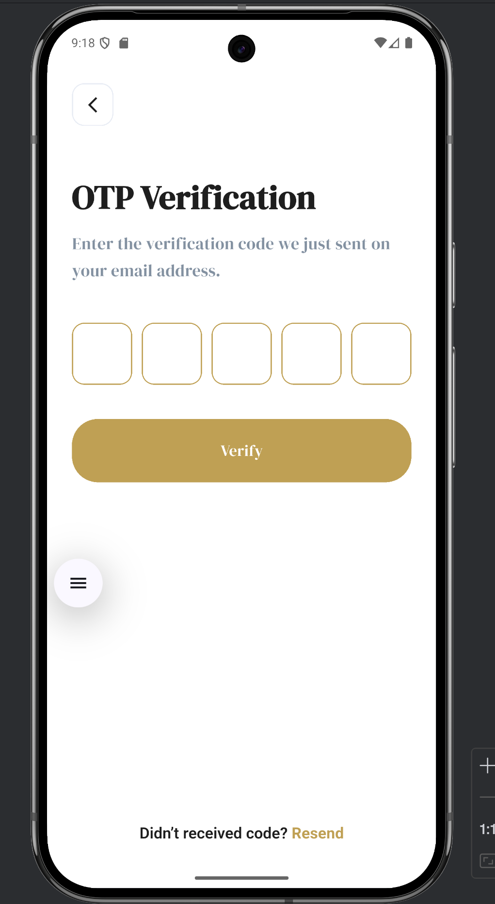
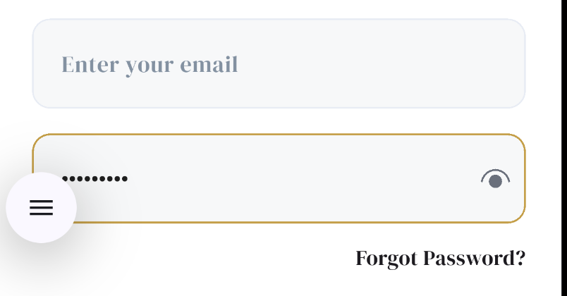
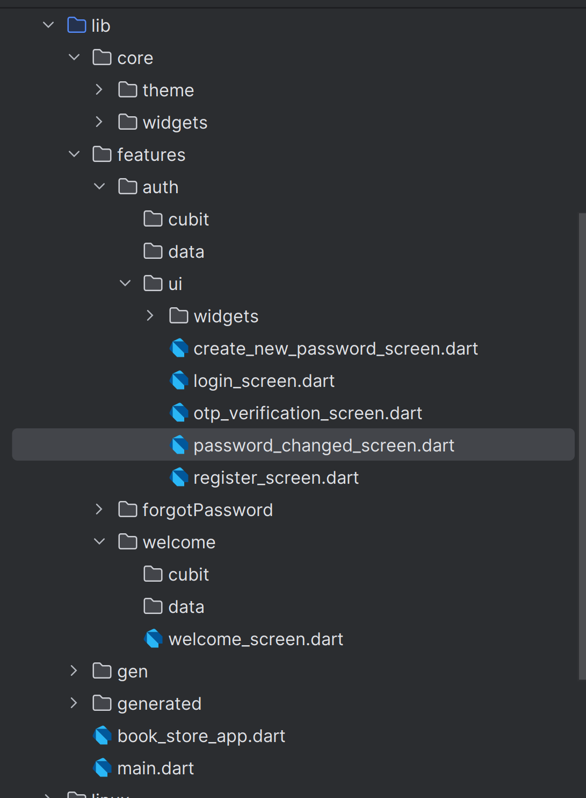

# Bookia

Bookia is a Flutter application for browsing books with a clean and modern user experience.  
The app includes authentication flow, password recovery flow, and a scalable structure prepared for API integration and feature expansion.

## Features

- Clean and responsive UI
- Login and Register screens
- Forgot Password flow
- OTP Verification
- Create New Password
- Password Changed confirmation
- Multi-language support
- Reusable core widgets
- Feature-based project structure
- Ready for backend/API integration

## Tech Stack

- Flutter
- Dart
- flutter_screenutil
- easy_localization
- Reusable Core Components
- Feature-first architecture

## Screenshots

### Welcome Screens

<p align="center">
  
  
</p>

### Authentication

<p align="center">
  
  
</p>

### Password Recovery Flow

<p align="center">
  
  
  
  
</p>

### More Screens

<p align="center">
  
  
</p>

## Project Structure

```bash
lib/
├── core/
│   ├── theme/
│   └── widgets/
├── features/
│   ├── auth/
│   │   ├── cubit/
│   │   ├── data/
│   │   └── ui/
│   └── welcome/
└── generated/